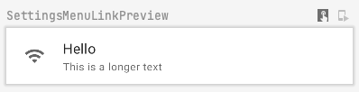
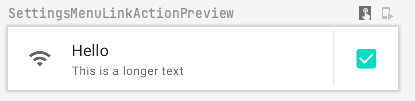
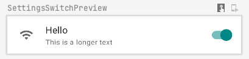
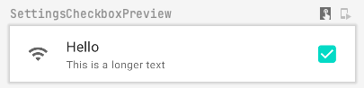

# Compose Settings

### Versions


This library provides a set of **Settings** like composable items to help android *Jetpack Compose*
developers build complex settings screens without all the boilerplate

## Install

```groovy
allprojects {
  repositories {
    //...
    mavenCentral()
  }
}
```

Add dependencies:

```groovy
implementation 'com.github.alorma:compose-settings-ui:$version'
```

## Demo

|Menu link|Switch|Checkbox|
|--|--|--|
| |||

## Usage

This library provide some `@Composable` items that can be used to build your settings screen.

`Scaffold`, `Column`... is not provided by the library, you can place items wherever you want.

### Menu Link

[Android docs](https://source.android.com/devices/tech/settings/settings-guidelines#menu_link)



This can be used to open another settings screen, open link, show a dialog...

```kotlin
SettingsMenuLink(
  icon = { Icon(imageVector = Icons.Default.Wifi, contentDescription = "Wifi") },
  title = { Text(text = "Hello") },
  subtitle = { Text(text = "This is a longer text") },
  onClick = {},
)
```

`action` can be provided:

```kotlin
SettingsMenuLink(
  title = { Text(text = "Menu 4") },
  action = { ... },
)
```



### Switch && Checkboxes

[Android docs - Switch](https://source.android.com/devices/tech/settings/settings-guidelines#switch)



[Android docs - Checkbox](https://source.android.com/devices/tech/settings/settings-guidelines#checkbox)



This can be used to enable or disable a feature

```kotlin
SettingsCheckbox(
  icon = { Icon(imageVector = Icons.Default.Wifi, contentDescription = "Wifi") },
  title = { Text(text = "Hello") },
  subtitle = { Text(text = "This is a longer text") },
  onCheckedChange = { newValue -> },
)
```

```kotlin
SettingsCheckbox(
  icon = { Icon(imageVector = Icons.Default.Wifi, contentDescription = "Wifi") },
  title = { Text(text = "Hello") },
  subtitle = { Text(text = "This is a longer text") },
  onCheckedChange = { newValue -> },
)
```

### State

In order to provide a default value for the setting and recompose when state changes, you must use `state` parameter.

#### Installation

```groovy
implementation 'com.github.alorma:compose-settings-storage-preferences:$version'
```

```kotlin
val state = rememberBooleanSettingState()
SettingsCheckbox(state = state)

val state = rememberFloatSettingState()
SettingSlider(state = state)
```

And, you can react to state change, for example:

```kotlin
val state = rememberBooleanSettingState()

if (state.value) {
  Text("Enabled")
} else {
  Text("Disabled")
}

val state = rememberBooleanSettingState()

if (state.value > 0.5f) {
  Icon(imageVector = Icons.Default.BrightnessLow)
} else {
  Icon(imageVector = Icons.Default.BrightnessHigh)
}
```

This library provide default value for state as `false`, however if you need to pass a different value (`true`), you can use:

```kotlin
val state = rememberBooleanSettingState(defaultValue = true)
val state = rememberFloatSettingState(defaultValue = 0.1f)
```

Also, the library provides a **preferences** version of the state, so when setting state is changed, the value is persisted on the
preferences.

```kotlin
val state = rememberPreferenceBooleanSettingState(key = "pref_key", defaultValue = true)
val state = rememberPreferenceFloatSettingState(key = "pref_key", defaultValue = 0.1f)
```
