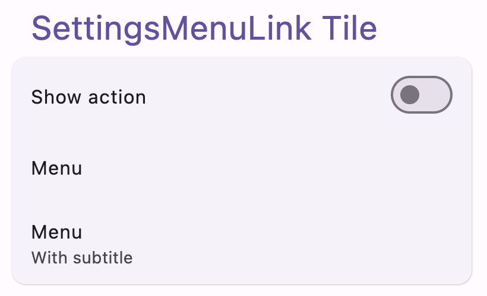
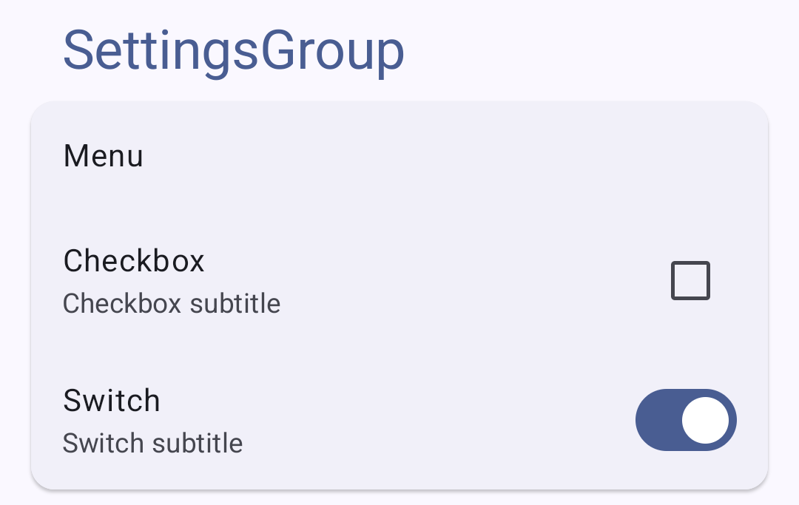

# Compose Settings - Multiplatform

<div>
 


</div>

[](https://github.com/alorma/Compose-Settings/actions/workflows/main.yml)
[](https://central.sonatype.com/namespace/com.github.alorma.compose-settings)


<a href="https://www.buymeacoffee.com/alorma" target="_blank"></a>


### Preview

This library provides a set of **Settings** like composable items to help android *Jetpack Compose*
developers build complex settings screens without all the boilerplate.

**Ui tiles**

| Component                                             | Screenshot                                                                       |
|-------------------------------------------------------|----------------------------------------------------------------------------------|
| [SettingsMenuLink](#SettingsMenuLink)                 |                   |
| [SettingsCheckbox](#SettingsCheckbox)                 |                |
| [SettingsTriStateCheckbox](#SettingsTriStateCheckbox) |  |
| [SettingsRadioButton](#SettingsRadioButton)           |          |
| [SettingsSwitch](#SettingsSwitch)                     |                    |
| [SettingsGroup](#SettingsGroup)                      |                      |

**Ui tiles expanded**

| Component                         | Screenshot                                                     |
|-----------------------------------|----------------------------------------------------------------|
| [SettingsSlider](#SettingsSlider) |  |

## Install

```
##// groovy
implementation 'com.github.alorma.compose-settings:ui-tiles:$version'
implementation 'com.github.alorma.compose-settings:ui-tiles-extended:$version'

[...]

// kotlin DSL

implementation("com.github.alorma.compose-settings:ui-tiles:$version")
implementation("com.github.alorma.compose-settings:ui-tiles-extended:$version")

[...]

// Catalog versions:

[versions]
compose-settings = "{{libVersion}}"

[libraries]
composeSettings-ui = { group = "com.github.alorma.compose-settings", name = "ui-tiles", version.ref = "compose-settings" }
composeSettings-ui-extended = { group = "com.github.alorma.compose-settings", name = "ui-tiles-extended", version.ref = "compose-settings" }
```

## Usage

##### SettingsMenuLink:

```kotlin
SettingsMenuLink(
  title = { Text(text = "Setting title") },
  subtitle = { Text(text = "Setting subtitle") },
  modifier = Modifier,
  enabled = false / true,
  icon = { Icon(...) },
  action = { IconButton() },
  onClick = { ... },
)
```


##### SettingsCheckbox:

```kotlin
SettingsCheckbox(
  state = false / true,
  title = { Text(text = "Setting title") },
  subtitle = { Text(text = "Setting subtitle") },
  modifier = Modifier,
  enabled = false / true,
  icon = { Icon(...) },
  onCheckedChange = { newState: Boolean -> },
)
```


##### SettingsTriStateCheckbox:

```kotlin
SettingsTriStateCheckbox(
  state = false / true / null,
  title = { Text(text = "Setting title") },
  subtitle = { Text(text = "Setting subtitle") },
  modifier = Modifier,
  enabled = false / true,
  icon = { Icon(...) },
  onCheckedChange = { newState: Boolean -> },
)
```


##### SettingsRadioButton:

```kotlin
SettingsRadioButton(
  state = false / true,
  title = { Text(text = "Setting title") },
  subtitle = { Text(text = "Setting subtitle") },
  modifier = Modifier,
  enabled = false / true,
  icon = { Icon(...) },
  onClick = { },
)
```


##### SettingsSwitch:

```kotlin
SettingsSwitch(
  state = false / true,
  title = { Text(text = "Setting title") },
  subtitle = { Text(text = "Setting subtitle") },
  modifier = Modifier,
  enabled = false / true,
  icon = { Icon(...) },
  onCheckedChange = { newState: Boolean -> },
)
```


##### SettingsSlider:

```kotlin
SettingsSlider(
  value = x.xf,
  valueRange = X.f..Y.f,
  steps = X,
  title = { Text(text = "Setting title") },
  subtitle = { Text(text = "Setting subtitle") },
  modifier = Modifier,
  enabled = false / true,
  icon = { Icon(...) },
  onValueChange = { newValue: Float -> },
)
```


##### SettingsGroup

> Updates on `enabled` will be reflected on it's internal components unless you change their `enabled` state manually.

```kotlin
SettingsGroup(
  modifier = Modifier,
  enabled = false / true,
  title = { Text(text = "SettingsGroup") },
  contentPadding = PaddingValues(16.dp),
) {
    SettingsMenuLink(...)
    SettingsCheckbox(...)
    SettingsSwitch(...)
    ...
}
```


