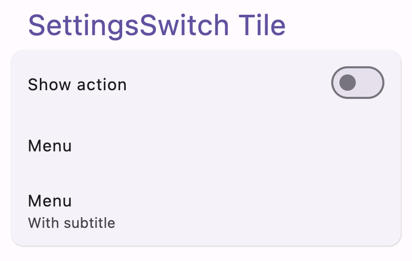
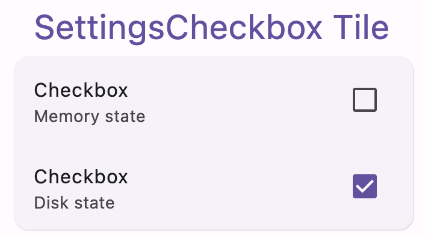
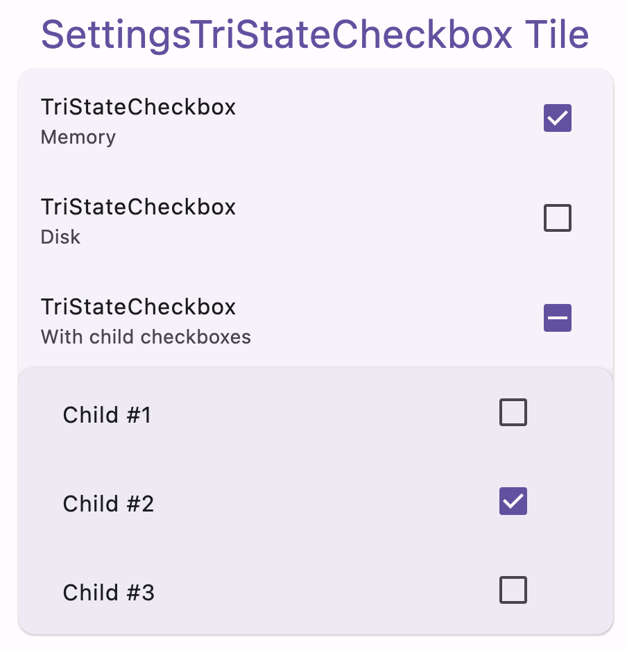
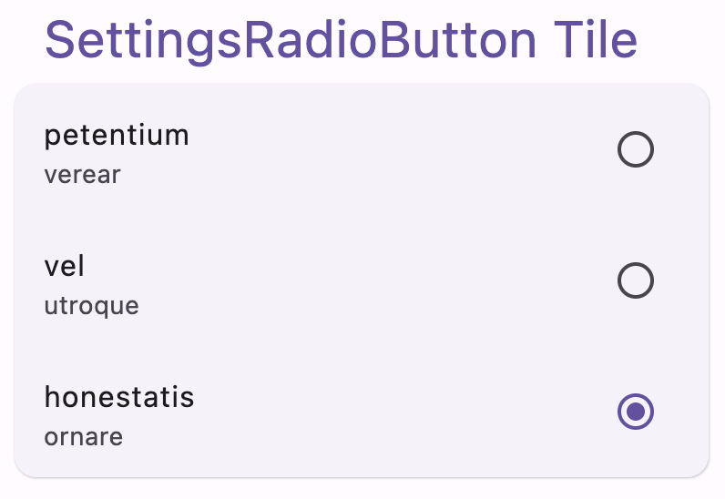
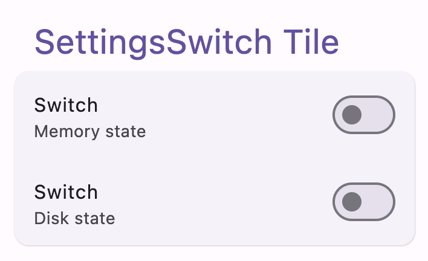
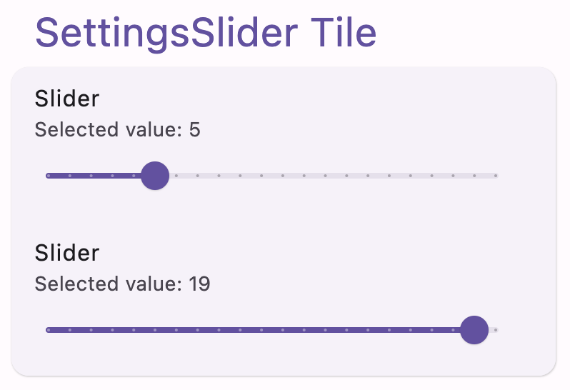

# Compose Settings - Multiplatform

[](https://github.com/alorma/Compose-Settings/actions/workflows/main.yml)
[](https://search.maven.org/search?q=g:%22com.github.alorma.compse-settings%22%20AND%20a:%22ui-tiles%22)

### Preview

This library provides a set of **Settings** like composable items to help android *Jetpack Compose*
developers build complex settings screens without all the boilerplate.

**Ui tiles**

| Component                | Screenshot                                                                       |
|--------------------------|----------------------------------------------------------------------------------|
| SettingsMenuLink         |                        |
| SettingsCheckbox         |                |
| SettingsTriStateCheckbox |  |
| SettingsRadioButton      |          |
| SettingsSwitch           |                    |


**Ui tiles expanded**

| Component                | Screenshot                                                                       |
|--------------------------|----------------------------------------------------------------------------------|
| SettingsSlider           |                    |

## Install

```
##// groovy
implementation 'com.github.alorma.compose-settings:ui-tiles:$version'
implementation 'com.github.alorma.compose-settings:ui-tiles-extended:$version'

[...]

// kotlin DSL

implementation("com.github.alorma.compose-settings:ui-tiles:$version")
implementation("com.github.alorma.compose-settings:ui-tiles-extended:$version")

[...]

// Catalog versions:

[versions]
compose-settings = "2.1.0"

[libraries]
composeSettings-ui = { group = "com.github.alorma.compose-settings", name = "ui-tiles", version.ref = "compose-settings" }
composeSettings-ui-extended = { group = "com.github.alorma.compose-settings", name = "ui-tiles-extended", version.ref = "compose-settings" }
```

## Usage

**SettingsMenuLink:**

```kotlin
SettingsMenuLink(
  title = { Text(text = "Setting title") },
  subtitle = { Text(text = "Setting subtitle") },
  modifier = Modifier,
  enabled = false/true,
  icon = { Icon(...) },
  action = { IconButton() },
  onClick = { ... },
)
```


## Install - Storage

```
##// groovy
implementation 'com.github.alorma.compose-settings:storage-memory:$version'
implementation 'com.github.alorma.compose-settings:storage-disk:$version'

[...]

// kotlin DSL

implementation("com.github.alorma.compose-settings:storage-memory:$version")
implementation("com.github.alorma.compose-settings:storage-disk:$version")

[...]

// Catalog versions:

[versions]
compose-settings = "2.1.0"
[libraries]
composeSettings-storage-memory = { group = "com.github.alorma.compose-settings", name = "storage-memory", version.ref = "compose-settings" }
composeSettings-storage-disk = { group = "com.github.alorma.compose-settings", name = "storage-disk", version.ref = "compose-settings" }
```
