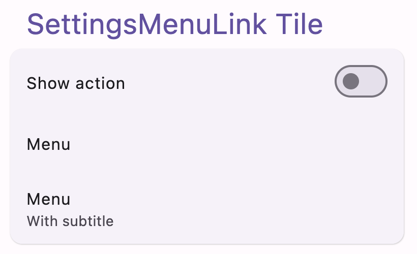
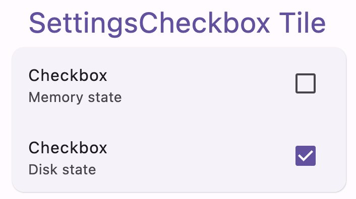
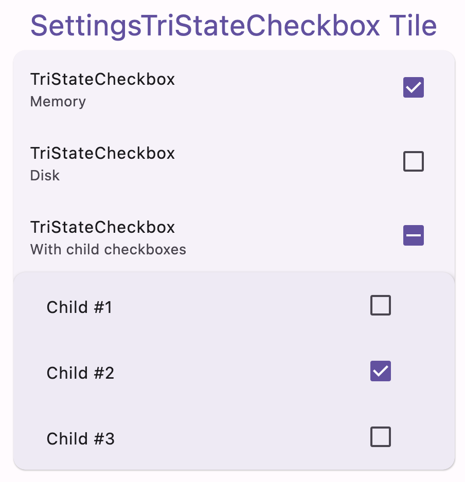
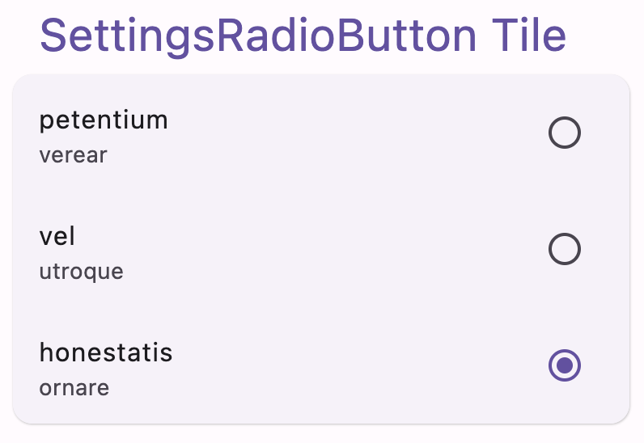
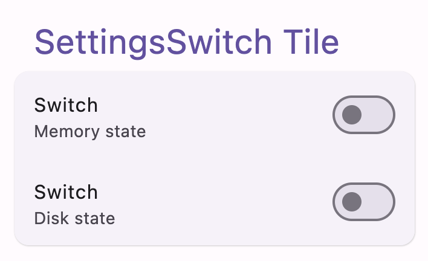
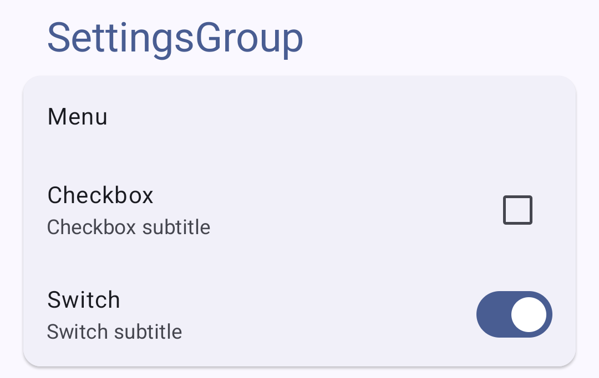
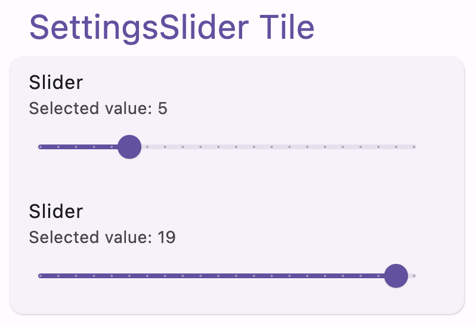

# Compose Settings - Multiplatform

<div>
 


</div>

[](https://github.com/alorma/Compose-Settings/actions/workflows/main.yml)
[](https://central.sonatype.com/namespace/com.github.alorma.compose-settings)
[](https://opensource.org/licenses/MIT)


[](https://alorma.github.io/Compose-Settings/dokka)

<a href="https://www.buymeacoffee.com/alorma" target="_blank"></a>

### Preview

This library provides a set of **Settings** like composable items to help android *Jetpack Compose*
developers build complex settings screens without all the boilerplate.

Two flavors are available: standard **Material 3** components and **Material 3 Expressive** components.
The expressive variants are built on `SegmentedListItem` and support segmented list styling.

**Ui tiles** (`ui-tiles`) — Material 3

| Component                                             | Screenshot                                                                       |
|-------------------------------------------------------|----------------------------------------------------------------------------------|
| [SettingsMenuLink](#SettingsMenuLink)                 |                   |
| [SettingsCheckbox](#SettingsCheckbox)                 |                |
| [SettingsTriStateCheckbox](#SettingsTriStateCheckbox) |  |
| [SettingsRadioButton](#SettingsRadioButton)           |          |
| [SettingsSwitch](#SettingsSwitch)                     |                    |
| [SettingsGroup](#SettingsGroup)                       |                      |

**Ui tiles extended** (`ui-tiles-extended`) — Material 3

| Component                                   | Screenshot                                                     |
|---------------------------------------------|----------------------------------------------------------------|
| [SettingsSlider](#SettingsSlider)           |  |
| [SettingsSegmented](#SettingsSegmented)     |                                                                |

**Ui tiles expressive** (`ui-tiles-expressive`) — Material 3 Expressive

> Requires Material 3 Expressive API (`@OptIn(ExperimentalMaterial3ExpressiveApi::class)`).
> All components support segmented list styling via the `shapes` parameter.

| Component                                                         | Screenshot                                                                 |
|-------------------------------------------------------------------|----------------------------------------------------------------------------|
| [SettingsMenuLink (Expressive)](#SettingsMenuLink-Expressive)     |             |
| [SettingsCheckbox (Expressive)](#SettingsCheckbox-Expressive)     |          |
| [SettingsTriStateCheckbox (Expressive)](#SettingsTriStateCheckbox-Expressive) |                                                                |
| [SettingsRadioButton (Expressive)](#SettingsRadioButton-Expressive) |  |
| [SettingsSwitch (Expressive)](#SettingsSwitch-Expressive)         |              |
| [SettingsGroup (Expressive)](#SettingsGroup-Expressive)           |                                                                            |
| [SettingsButtonGroup](#SettingsButtonGroup)                       |  |

## Install

Pick the module(s) you need:

| Module | Contents |
|--------|----------|
| `ui-tiles` | Standard M3: MenuLink, Checkbox, TriStateCheckbox, RadioButton, Switch, Group |
| `ui-tiles-extended` | Standard M3: Slider, Segmented |
| `ui-tiles-expressive` | Expressive M3: all of the above + ButtonGroup, with segmented list support |

```
// groovy
implementation 'com.github.alorma.compose-settings:ui-tiles:$version'
implementation 'com.github.alorma.compose-settings:ui-tiles-extended:$version'
implementation 'com.github.alorma.compose-settings:ui-tiles-expressive:$version'

[...]

// kotlin DSL

implementation("com.github.alorma.compose-settings:ui-tiles:$version")
implementation("com.github.alorma.compose-settings:ui-tiles-extended:$version")
implementation("com.github.alorma.compose-settings:ui-tiles-expressive:$version")

[...]

// Catalog versions:

[versions]
compose-settings = "{{libVersion}}"

[libraries]
composeSettings-ui = { group = "com.github.alorma.compose-settings", name = "ui-tiles", version.ref = "compose-settings" }
composeSettings-ui-extended = { group = "com.github.alorma.compose-settings", name = "ui-tiles-extended", version.ref = "compose-settings" }
composeSettings-ui-expressive = { group = "com.github.alorma.compose-settings", name = "ui-tiles-expressive", version.ref = "compose-settings" }
```

## Usage

### Customization

All settings components support customization through common parameters:

#### Shape

Customize the shape of any settings component using the `shape` parameter:

```kotlin
SettingsSwitch(
  state = switchState,
  title = { Text("Rounded corners") },
  shape = RoundedCornerShape(16.dp), // Custom shape
  onCheckedChange = { switchState = it },
)
```

Available shapes include:
- `RoundedCornerShape(size)` - Rounded corners
- `CutCornerShape(size)` - Cut corners
- `CircleShape` - Fully circular
- Custom shapes implementing the `Shape` interface

#### Text Styles

Customize title and subtitle text styles using the `textStyles` parameter:

```kotlin
SettingsCheckbox(
  state = checkboxState,
  title = { Text("Custom styled title") },
  subtitle = { Text("Custom styled subtitle") },
  textStyles = SettingsTileDefaults.textStyles(
    titleStyle = MaterialTheme.typography.headlineSmall.copy(fontWeight = FontWeight.Bold),
    subtitleStyle = MaterialTheme.typography.bodyLarge,
  ),
  onCheckedChange = { checkboxState = it },
)
```

This allows you to:
- Change font sizes, weights, and families
- Adjust letter spacing and line height
- Apply custom colors and decorations
- Match your app's typography system

### Components

#### Material 3 (`ui-tiles`, `ui-tiles-extended`)

##### SettingsMenuLink:

```kotlin
SettingsMenuLink(
  title = { Text(text = "Setting title") },
  subtitle = { Text(text = "Setting subtitle") },
  modifier = Modifier,
  enabled = false / true,
  icon = { Icon(...) },
  action = { IconButton() },
  onClick = { ... },
)
```


##### SettingsCheckbox:

```kotlin
SettingsCheckbox(
  state = false / true,
  title = { Text(text = "Setting title") },
  subtitle = { Text(text = "Setting subtitle") },
  modifier = Modifier,
  enabled = false / true,
  icon = { Icon(...) },
  onCheckedChange = { newState: Boolean -> },
)
```


##### SettingsTriStateCheckbox:

```kotlin
SettingsTriStateCheckbox(
  state = false / true / null,
  title = { Text(text = "Setting title") },
  subtitle = { Text(text = "Setting subtitle") },
  modifier = Modifier,
  enabled = false / true,
  icon = { Icon(...) },
  onCheckedChange = { newState: Boolean -> },
)
```


##### SettingsRadioButton:

```kotlin
SettingsRadioButton(
  state = false / true,
  title = { Text(text = "Setting title") },
  subtitle = { Text(text = "Setting subtitle") },
  modifier = Modifier,
  enabled = false / true,
  icon = { Icon(...) },
  onClick = { },
)
```


##### SettingsSwitch:

```kotlin
SettingsSwitch(
  state = false / true,
  title = { Text(text = "Setting title") },
  subtitle = { Text(text = "Setting subtitle") },
  modifier = Modifier,
  enabled = false / true,
  icon = { Icon(...) },
  onCheckedChange = { newState: Boolean -> },
)
```


##### SettingsSlider:

```kotlin
SettingsSlider(
  value = x.xf,
  valueRange = X.f..Y.f,
  steps = X,
  title = { Text(text = "Setting title") },
  subtitle = { Text(text = "Setting subtitle") },
  modifier = Modifier,
  enabled = false / true,
  icon = { Icon(...) },
  onValueChange = { newValue: Float -> },
)
```


##### SettingsSegmented:

```kotlin
SettingsSegmented(
  title = { Text(text = "Setting title") },
  items = listOf(1, 2, 3),
  selectedItem = 2,
  itemTitleMap = { item -> "#$item" },
  onItemSelected = { selectedItem -> },
  modifier = Modifier,
  enabled = false / true,
  subtitle = { Text(text = "Setting subtitle") },
  icon = { Icon(...) },
)
```

##### SettingsGroup

> Updates on `enabled` will be reflected on its internal components unless you change their
`enabled` state manually.

```kotlin
SettingsGroup(
  modifier = Modifier,
  enabled = false / true,
  title = { Text(text = "SettingsGroup") },
  contentPadding = PaddingValues(16.dp),
  verticalArrangement = Arrangement.spacedBy(8.dp), // Spacing between items (default: 8.dp)
) {
    SettingsMenuLink(...)
    SettingsCheckbox(...)
    SettingsSwitch(...)
    ...
}
```

**Spacing customization:**

Control the spacing between items in the group using the `verticalArrangement` parameter:

```kotlin
// Compact spacing
SettingsGroup(
  verticalArrangement = Arrangement.spacedBy(4.dp),
) { ... }

// No spacing (tightly packed items)
SettingsGroup(
  verticalArrangement = Arrangement.Top,
) { ... }

// Large spacing
SettingsGroup(
  verticalArrangement = Arrangement.spacedBy(16.dp),
) { ... }
```


---

#### Material 3 Expressive (`ui-tiles-expressive`)

> These components require `@OptIn(ExperimentalMaterial3ExpressiveApi::class)`.
>
> They are built on `SegmentedListItem` and expose a `shapes: ListItemShapes` parameter,
> which enables the segmented list visual style (rounded groups of items with connected borders).

**Segmented list example:**

```kotlin
@OptIn(ExperimentalMaterial3ExpressiveApi::class)
val colors = ListItemDefaults.segmentedColors(
  containerColor = MaterialTheme.colorScheme.surfaceContainer,
)

SettingsSwitch(
  state = switchState,
  title = { Text("Wi-Fi") },
  colors = colors,
  shapes = ListItemDefaults.segmentedShapes(index = 0, count = 3),
  onCheckedChange = { switchState = it },
)
SettingsSwitch(
  state = switchState2,
  title = { Text("Bluetooth") },
  colors = colors,
  shapes = ListItemDefaults.segmentedShapes(index = 1, count = 3),
  onCheckedChange = { switchState2 = it },
)
SettingsMenuLink(
  title = { Text("Airplane mode") },
  colors = colors,
  shapes = ListItemDefaults.segmentedShapes(index = 2, count = 3),
  onClick = { },
)
```

> Use `ListItemDefaults.segmentedShapes(index, count)` to give each item the correct corner
> rounding based on its position in the group. Pair with
> `Arrangement.spacedBy(ListItemDefaults.SegmentedGap)` between items.

##### SettingsMenuLink (Expressive):

```kotlin
SettingsMenuLink(
  title = { Text(text = "Setting title") },
  subtitle = { Text(text = "Setting subtitle") },
  modifier = Modifier,
  enabled = false / true,
  icon = { Icon(...) },
  action = { IconButton() },
  colors = colors,
  shapes = ListItemDefaults.segmentedShapes(index, count),
  onClick = { ... },
)
```

##### SettingsCheckbox (Expressive):

```kotlin
SettingsCheckbox(
  state = false / true,
  title = { Text(text = "Setting title") },
  subtitle = { Text(text = "Setting subtitle") },
  modifier = Modifier,
  enabled = false / true,
  icon = { Icon(...) },
  colors = colors,
  shapes = ListItemDefaults.segmentedShapes(index, count),
  onCheckedChange = { newState: Boolean -> },
)
```

##### SettingsTriStateCheckbox (Expressive):

```kotlin
SettingsTriStateCheckbox(
  state = ToggleableState.On / ToggleableState.Off / ToggleableState.Indeterminate,
  title = { Text(text = "Setting title") },
  subtitle = { Text(text = "Setting subtitle") },
  modifier = Modifier,
  enabled = false / true,
  icon = { Icon(...) },
  colors = colors,
  shapes = ListItemDefaults.segmentedShapes(index, count),
  onCheckedChange = { newState: ToggleableState -> },
)
```

##### SettingsRadioButton (Expressive):

```kotlin
SettingsRadioButton(
  state = false / true,
  title = { Text(text = "Setting title") },
  subtitle = { Text(text = "Setting subtitle") },
  modifier = Modifier,
  enabled = false / true,
  icon = { Icon(...) },
  colors = colors,
  shapes = ListItemDefaults.segmentedShapes(index, count),
  onClick = { },
)
```

##### SettingsSwitch (Expressive):

```kotlin
SettingsSwitch(
  state = false / true,
  title = { Text(text = "Setting title") },
  subtitle = { Text(text = "Setting subtitle") },
  modifier = Modifier,
  enabled = false / true,
  icon = { Icon(...) },
  colors = colors,
  shapes = ListItemDefaults.segmentedShapes(index, count),
  onCheckedChange = { newState: Boolean -> },
)
```

##### SettingsGroup (Expressive):

> Works exactly like the M3 version. Pair with `Arrangement.spacedBy(ListItemDefaults.SegmentedGap)`
> and `ListItemDefaults.segmentedShapes` on children to achieve a connected segmented look.

```kotlin
SettingsGroup(
  modifier = Modifier,
  enabled = false / true,
  title = { Text(text = "SettingsGroup") },
  contentPadding = PaddingValues(16.dp),
  verticalArrangement = Arrangement.spacedBy(ListItemDefaults.SegmentedGap),
) {
    SettingsMenuLink(...)
    SettingsCheckbox(...)
    SettingsSwitch(...)
    ...
}
```

##### SettingsButtonGroup

> Exclusive to the expressive module. Uses `OutlinedToggleButton` from Material 3 Expressive.

```kotlin
SettingsButtonGroup(
  title = { Text(text = "Setting title") },
  items = listOf(1, 2, 3),
  selectedItem = 2,
  itemTitleMap = { item -> "#$item" },
  onItemSelected = { selectedItem -> },
  modifier = Modifier,
  enabled = false / true,
  subtitle = { Text(text = "Setting subtitle") },
  icon = { Icon(...) },
  colors = colors,
  shapes = ListItemDefaults.segmentedShapes(index, count),
)
```


